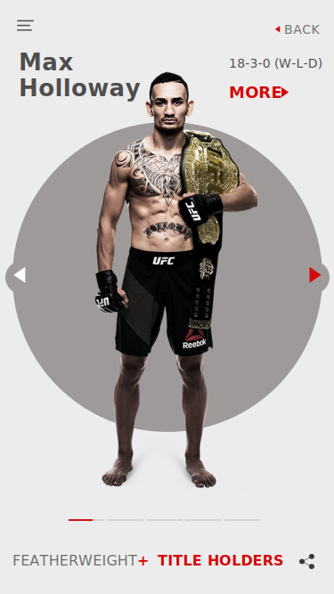
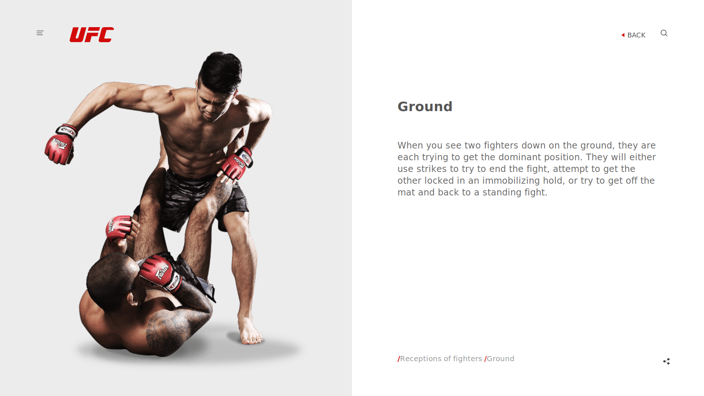
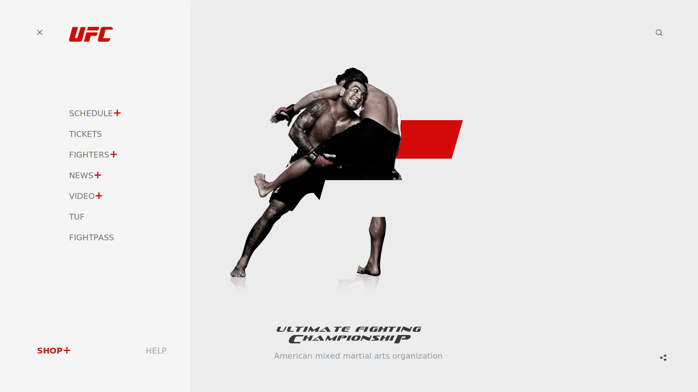

# UFC

I am trying to turn this dribbble mockup to an actual website using React-Redux, Sass.

I also want to create Node.js Restful API;  The idea is to get React  to communicate with Node.js  via a simple HTTP request and intern get Node.js to web scrape the Actually UFC site and pull their live data to my website.

<table>
    <thead>
        <h1> ---- Mockups ---</h1><i>NOT MY DESIGN</i>
    </thead>
    <tbody>
        <tr>
            <td></td>
            <td></td>
        </tr>
        <tr>
            <td></td>
            <td></td>
        </tr>
        <tr>
            <td></td>
            <td></td>
        </tr>
        <tr>
            <td></td>
            <td></td>
        </tr>
        <tr>
            <td></td>
            <td></td>
        </tr>
        <tr>
            <td></td>
            <td></td>
        </tr>
        <tr>
            <td></td>
            <td></td>
        </tr>
        <tr>
            <td></td>
            <td></td>
        </tr>
    </tbody>
</table>
